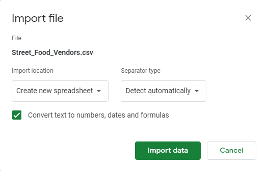
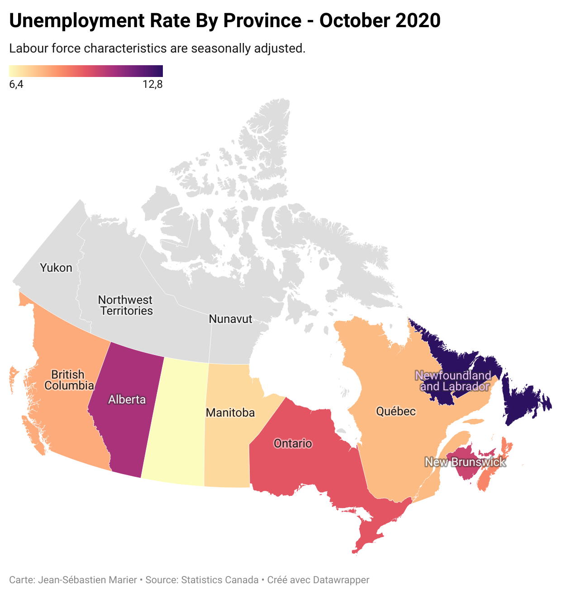

**Date**<br>
**Course Code & Course Name**<br>
**Student's First Name & Last Name**<br>
**Presented to Jean-Sébastien Marier**<br>

# Project 2: Basic Data Analysis & Visualization

Use one hashtag symbol (`#`) to create a level 1 heading like this one.

## Foreword

I have been assigning different versions of this project to my digital journalism and data storytelling students for a few years now. Its structure was inspired by the main sections/chapters of [*The Data Journalism Handbook*](https://datajournalism.com/read/handbook/one/). This version was further inspired by the [Key Capabilities in Data Science](https://extendedlearning.ubc.ca/programs/key-capabilities-data-science) program offered by the University of British Columbia (UBC).

**Here are some useful resources for this assignment:**

* [GitHub's *Basic writing and formatting syntax* page](https://docs.github.com/en/github/writing-on-github/getting-started-with-writing-and-formatting-on-github/basic-writing-and-formatting-syntax)
* [GitHub Guides: Mastering Markdown](https://guides.github.com/features/mastering-markdown/)
* [The template repository for this assignment in case you delete something by mistake](https://github.com/jsmarier/Template-for-the-Basic-Data-Analysis-Visualization-Project)

Did you notice how to create a hyperlink? In Markdown, we put the clickable text between square brackets and the actual URL between parentheses.

And to create an unordered list, we simply put a star (`*`) before each item.

## 1. Introduction

Insert text here.

## 2. Getting Data

Use two hashtag symbols (`##`) to create a level 2 heading like this one.

### 2.1. Importation

Use three hashtag symbols (`###`) to create a level 3 heading like this one. Please follow this template when it comes to level 1 and level 2 headings. However, you can use level 3 headings as you see fit.

To include a screen capture, use the sample code below. Your images should be saved in the same folder as your `.md` file.

<br>
*Figure 1: The "Import file" prompt on Google Sheets.*

**Here are examples of functions and lines of code put in grey boxes:**

1. If you name a function, put it between "angled" quotation marks like this: `IMPORTHTML`.
1. If you want to include the entire line of code, do the same thing, albeit with your entire code: `=IMPORTHTML("https://en.wikipedia.org/wiki/China"; "table", 5)`.
1. Alternatively, you can put your code in an independent box using the template below:

``` r
=IMPORTHTML("https://en.wikipedia.org/wiki/China"; "table", 5)
```
This also shows how to create an ordered list. Simply put `1.` before each item.

## 3. Understanding Data

Insert text here.

## 4. Delivering Data

Insert text here.

**This section should include a screen capture of your chart and its public link, like so:**

<br>
*Figure 2: The map created with Datawrapper*
[Interactive version here](https://datawrapper.dwcdn.net/o7Wwp/2/)

## 5. Conclusion

Thank you for reading my report.

## 6. References

Include a list of your references here.
